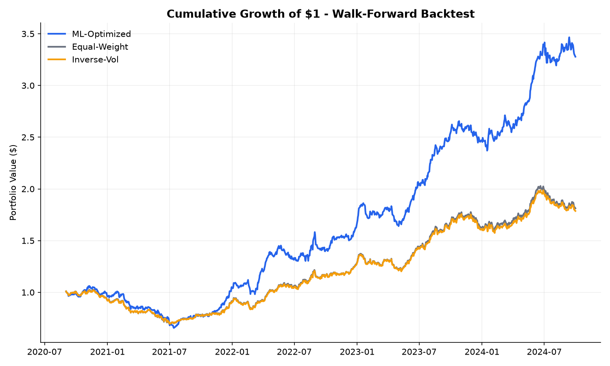
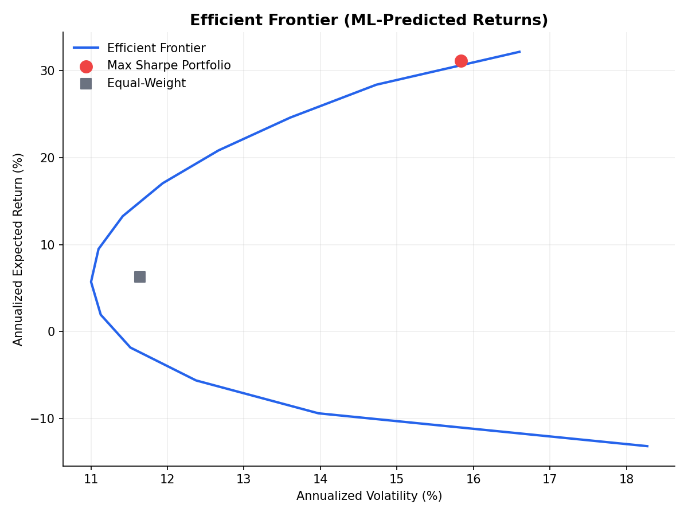
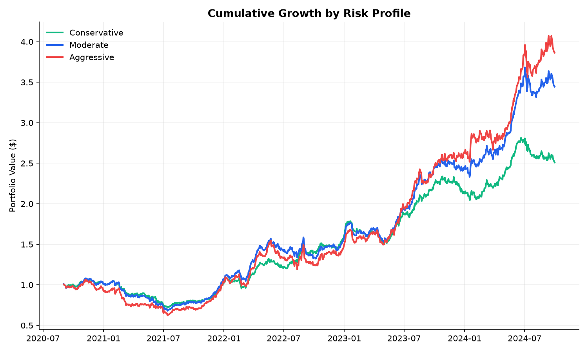

# ML-Driven Portfolio Optimization

An ML-driven portfolio construction system built to show off the full quant research stack, from features all the way to a properly out-of-sample-tested Sharpe ratio.

Combines a gradient-boosted return forecaster with mean-variance
optimization, evaluated with a proper walk-forward backtest against
equal-weight and inverse-vol benchmarks.

## Pipeline

Prices -> Features -> ML Model -> Expected Returns (mu)
|
Prices -> Rolling Window -> Ledoit-Wolf -> Covariance (Sigma)
|
Mean-Variance Optimizer
max Sharpe, long-only, 25% cap per asset
|
Walk-Forward Backtest
monthly rebalance, transaction costs
|
Sharpe / Sortino / Max DD / Calmar vs benchmarks


## Notes on the design choices

**Data.** No internet access in the environment I built this in, so
`data/generate_data.py` simulates a 15-asset universe: a 3-factor macro
structure, vol regime switching, occasional jumps, and a slow-moving
per-asset alpha state that gives medium-term momentum (21-126 day
windows) real predictive power - basically trying to mirror the
empirical equity momentum literature instead of just being noise dressed
up as data. To run this on real data, swap out `load_prices()` for a
`yfinance` pull - everything downstream just expects a plain
`(date x ticker)` price DataFrame.

**Features.** Momentum at a few horizons, realized vol, vol-of-vol
(regime proxy), price vs moving average, RSI, and cross-sectional
momentum rank. All computed strictly from information available at time t.

**Model.** Gradient boosted trees. Went with this over a linear model
because it picks up nonlinear feature interactions, and over a neural
net because with ~15 assets and a few thousand rows a shallow tree
ensemble generalizes a lot better and doesn't need nearly as much data.

**No lookahead.** The model gets retrained from scratch at every monthly
rebalance, using only rows whose forward-return label window has
actually closed before that date. This is the most common bug in
homegrown backtests - handled in `src/models.py::train_predict_walk_forward`.

**Risk model.** Sample covariance is noisy with limited history (the
classic Markowitz estimation-error issue). Ledoit-Wolf shrinkage toward
a structured target fixes this and is standard practice.

**Optimizer.** Constrained mean-variance via `scipy.SLSQP` - fully
invested, long-only. On top of the base setup, `src/optimizer.py` supports:

- **Risk appetite**, exposed either as a continuous `risk_aversion`
  parameter (classic Markowitz quadratic utility: maximize
  `w'mu - (lambda/2) w'Sigma w`, higher lambda = more conservative) or
  as three presets - `conservative` / `moderate` / `aggressive` - each
  bundling a sensible risk-aversion value with a matching per-asset cap,
  so it can be exposed as a single dropdown instead of asking someone to
  pick a lambda out of the air.
- **Return targeting**: `target_return` adds a minimum-return constraint
  so you can solve for the lowest-risk portfolio that still hits a
  required return, instead of only ever maximizing Sharpe.
- **Per-asset bounds**: `asset_bounds` overrides the uniform cap for
  specific names (e.g. force a minimum position, or lock an asset out
  entirely).
- **Sector constraints**: `sector_map` + `sector_caps` cap total exposure
  to a given sector (e.g. keep tech under 40%), which matters in practice
  since an unconstrained optimizer will happily concentrate in whatever
  correlated cluster of names the model likes that month.

**Backtest.** Monthly rebalancing, 10bps transaction cost per unit
turnover, weights drift with returns between rebalances rather than
being artificially reset daily. Benchmarked against equal-weight and
inverse-vol - the two things any "smarter" weighting scheme actually
needs to beat.

## Results (synthetic universe, 2019-2024)

| Strategy | CAGR | Ann. Vol | Sharpe | Max DD |
|---|---|---|---|---|
| ML-Optimized | 33.5% | 17.9% | 1.59 | -35.0% |
| Equal-Weight | 15.1% | 14.0% | 0.94 | -32.3% |
| Inverse-Vol | 14.7% | 13.8% | 0.92 | -31.6% |




Out-of-sample information coefficient (spearman rank corr between
predicted and realized forward returns) came out to about 0.07, which is
in line with genuinely useful equity factors in practice - most good
signals run 0.03-0.08 IC. Anything much higher than that on real data
would be a red flag, not a win.

Worth saying plainly: this is a controlled synthetic environment built
specifically to contain a learnable signal, so these numbers won't hold
up as-is on live markets. The point of the project is the methodology -
no-lookahead walk-forward evaluation, shrinkage risk estimation,
constrained optimization, actually benchmarking against something -
not the specific Sharpe ratio.

### Risk appetite comparison

| Profile | CAGR | Ann. Vol | Sharpe | Max DD |
|---|---|---|---|---|
| Conservative | 25.2% | 16.3% | 1.34 | -30.0% |
| Moderate | 34.4% | 19.6% | 1.51 | -35.4% |
| Aggressive | 36.4% | 22.8% | 1.39 | -41.2% |



Same underlying model and predictions, three different risk-aversion
settings in the optimizer. Vol and drawdown scale up monotonically with
risk appetite as expected; Sharpe peaking in the middle rather than at
either extreme is a realistic pattern, not a bug - very low risk
aversion lets the optimizer concentrate hard in whatever the model likes
most that month, which raises return but eventually costs more in risk
than it earns back.

## Structure

portfolio-ml/
├── data/
│ └── generate_data.py synthetic market simulator
├── src/
│ ├── features.py feature engineering, no-lookahead labels
│ ├── models.py walk-forward ML training/prediction
│ ├── risk.py Ledoit-Wolf covariance estimation
│ ├── optimizer.py mean-variance optimization, risk profiles, constraints
│ └── backtest.py walk-forward backtest engine + metrics
├── main.py runs the full pipeline
├── requirements.txt
└── outputs/ generated charts + metrics


## Running it

```bash
pip install -r requirements.txt
python3 main.py
```

Outputs land in `outputs/`: cumulative returns, drawdown, efficient
frontier, weights over time, feature importance, and a metrics CSV.

## Possible extensions

- Black-Litterman to blend the ML's views with a market-cap prior, reducing sensitivity to noisy point estimates of mu
- Purged/embargoed cross-validation instead of a simple chronological split, to more rigorously bound label leakage
- A small Streamlit/Flask front end exposing the risk profile picker and constraint inputs directly, instead of editing kwargs in code
